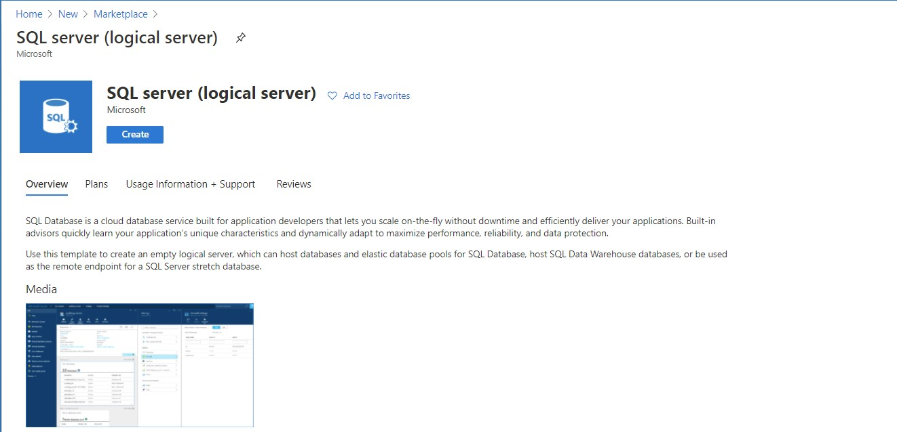
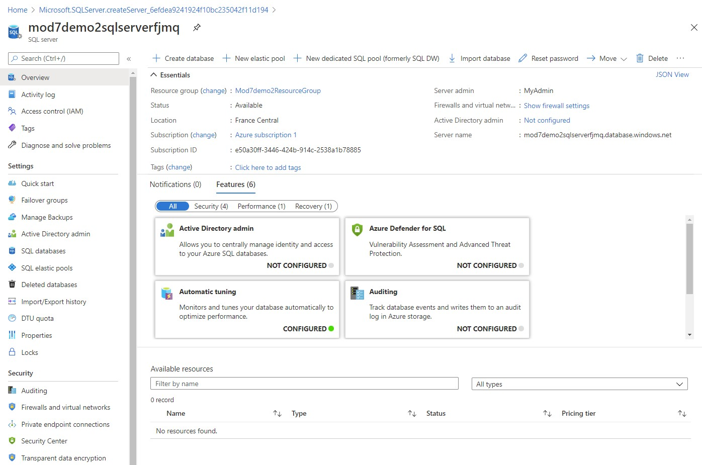
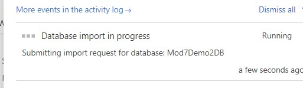
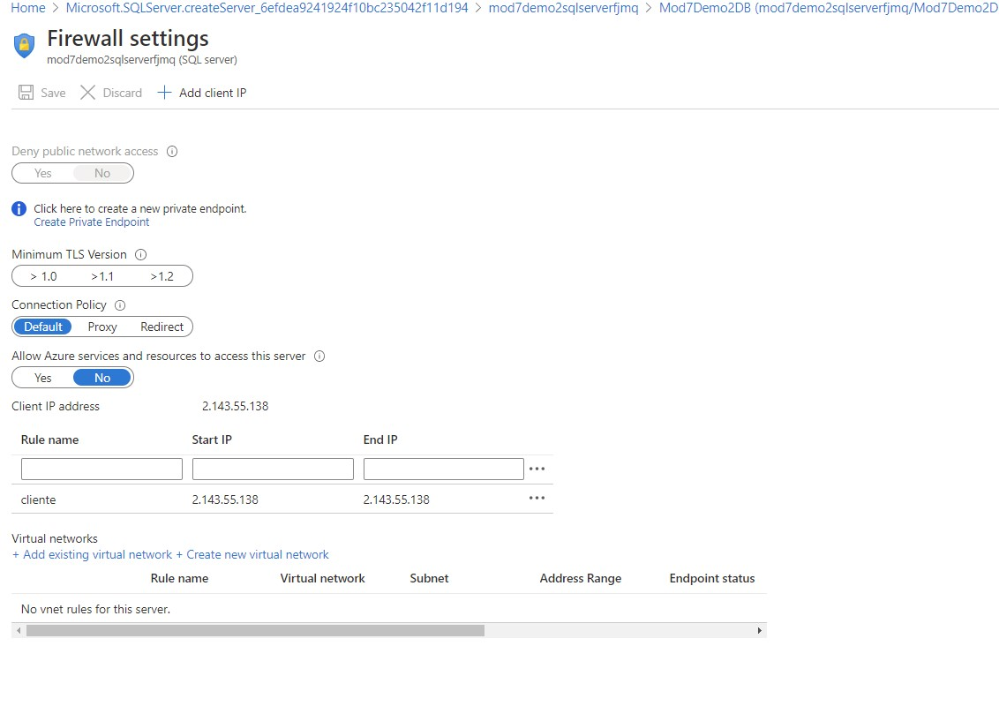
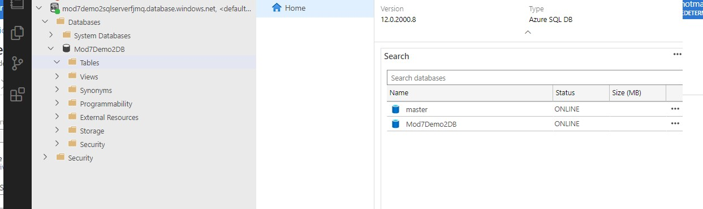

# Module 7: Implementing data storage in Azure

# Lesson 3: Working with Structured Data in Azure

### Demonstration: Uploading an Azure SQL Database to Azure and Accessing it Locally

- Creamos una cuenta de almacenamiento
- Subimos el fichero **Mod7Demo2DB.bacpac** a esa cuenta para importar la BBDD
- Creamos un  **SQL server (logical server)**.

- Pulsamos sobre Import Database. Seleccionamos la cuenta de almacenamiento, el contenedor **bacpaccontainer** y el fichero  **Mod7Demo2DB.bacpac**.

  

- Seleccionamos la base de datos que se ha creado 

- seleccionamos la BD **Mod7Demo2DB**. y pulsamos sobre **Set server firewall**.

- Añadimos la IP de nuestro cliente  para poder acceder desde nuestro equipo

  

  

- Abrimos  Azure Data Studio y comprobamos la importación

